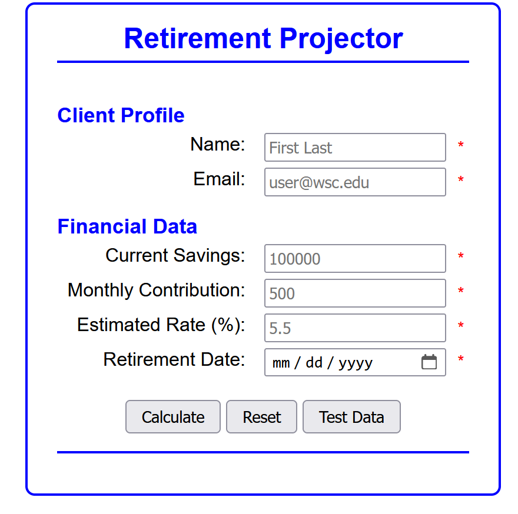
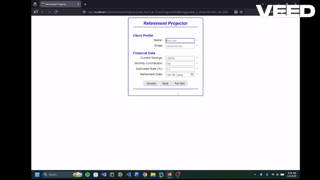
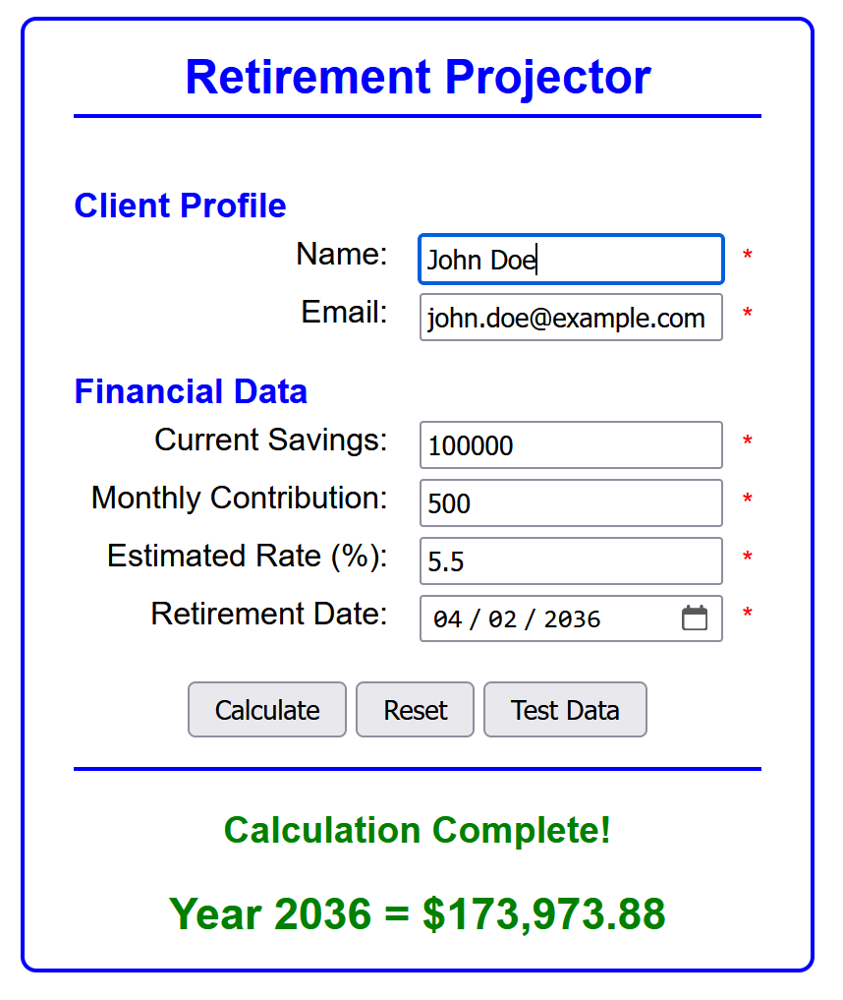
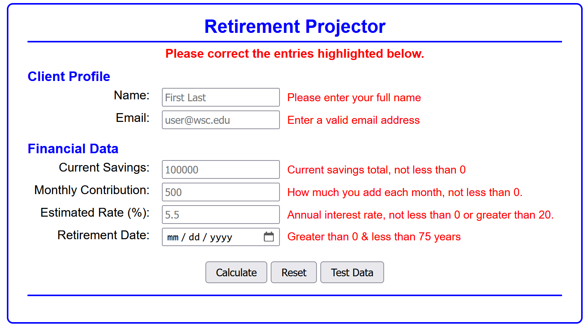

# Retirement Projector

 

---

## 👤 Authors
Ben Stearns - [@bstearns07](https://github.com/bstearns07) 
Isaiah Guilliatt - [@isguil02](https://github.com/isguil02)

---

## 📑 Table of Contents
- [📌 Summary](#-summary)
- [🚀 Live Demo](#-live-demo)
- [✨ Features](#-features)
- [🧰 Tech Stack](#-tech-stack)
- [⚙️ How It Works](#-how-it-works-)
- [🧠 Topics Covered](#-topics-covered)
- [📘 What We Learned](#-what-we-learned)
- [🖼 Screenshots](#-screenshots)

---

## 📌 Summary

Curious how much your retirement account will grow by the time you hang up your working hat for good? Then look no further. The Retirement Projector
will calculate how much your investment will grow over the years. Just tell it how much is currently in your account, 
how much expect to add each month, and your investment interest rate. The calculator will do the rest, displaying how your account will grow
over the years until your expected retirement date. Give it a try!

For full program details, refer to [Program Requirements](./assets/Assignment_Instructions.pdf) 

---

## 🚀 Live Demo
 
[🔗 Click Here to Give the Retirement Projector a Try! ↗](https://bstearns07.github.io/RetirementProjector/)

---

## ✨ Features

- HTML and custom JavaScript validation, including regular expressions
- Reset button for clearing all fields
- Test Data button for loading valid test entries into all fields
- Displays calculation results month by month, counting up to your retirement date using a timer
---

## 🧰 Tech Stack

### 🖥 Frontend
- HTML5 (Semantic Markup)
- CSS3 (Layout & Styling)
- Vanilla JavaScript (ES6+)

### 🧩 Core Concepts
- Date/Time management
- Timer functionality
- Data Validation through HTML and scripting
- Local data storage that stores your previous valid form data

### 🛠 Development Tools
- Git & GitHub
- WebStorm

---
## ⚙️ How It Works 

1. Open `index.html`
2. Enter valid entries into all fields
3. Click Calculate, and the calculator will display the growth of your investment month by month, counting up until your final retirement date
4. Click Reset to clear all fields/messages as needed
5. Click Test Data and then Calculate to load valid test data into all fields to see how it works
6. If you refresh the page, your last valid form submission data is automatically populated for as long as your current browser session is active

---
## Validation Requirements
1. All fields are required
2. Email must be a valid email according to a full regex pattern match
3. All numeric fields must be >= 0, including retirement date
4. Investment rate must be less than 20
5. Retirement date must be less than 75 years in the future

## 🧠 Topics Covered

- Time and Date Manipulation
- Data Validation through HTML attribute binding and scripting
- SetInterval() for executing timer functions
- Local Storage of user data

---

## 📘 What We Learned

We learned that some data validation can be achieved through HTML attributes alone. This can save a lot on coding this validation manually. However, 
are times HTML validation is often not sufficient, requiring more sophisticated validation requirements. This is where JavaScript can shine.
JavaScript provides for both client and server-side validation to ensure data is secure on both ends of the application. It was also great to learn
how JavaScript in particular interprets dates and milliseconds since epoch time and how to perform calculations with these figures. Timers are also
a powerful feauture to create very dynamic, time-sensitive applications by running functions at set intervals.

---

## 🖼 Screenshots

### 🖼 Default State

### Valid Data

### Invalid Data

⬆️ [Back to Top](#retirement-projector)
